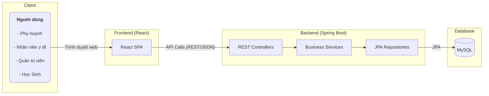
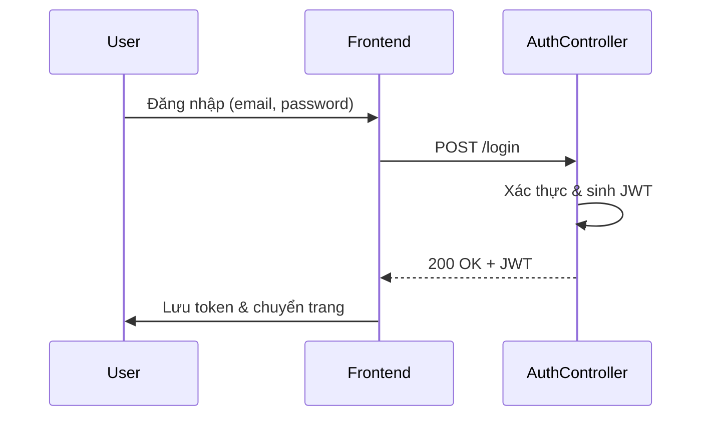
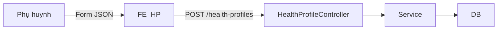
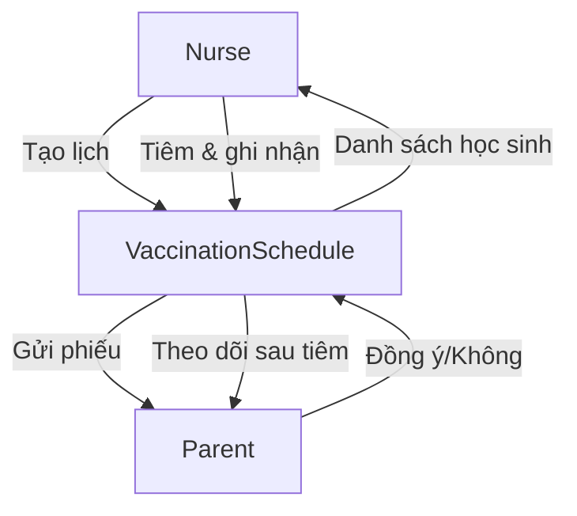

# Phần mềm Quản Lý Y Tế Học Đường

## 1. Giới thiệu tổng quan

Phần mềm **Quản Lý Y Tế Học Đường** được xây dựng nhằm hỗ trợ phòng y tế của một trường học trong việc quản lý hồ sơ sức khỏe, tiêm chủng, thuốc & vật tư y tế, cũng như xử lý và báo cáo các sự kiện y tế xảy ra với học sinh. Ứng dụng gồm:

* **Backend**: Spring Boot (Java 17) – cung cấp RESTful API, truy cập dữ liệu qua Spring Data JPA, đóng gói bằng Docker.
* **Frontend**: React 18 – giao diện người dùng đơn trang (SPA) sử dụng SCSS.
* **Database**: MySQL (chạy kèm Docker).
* **CI/CD**: Maven build, docker-compose orchestration.



## 2. Các chức năng nổi bật

1. Trang chủ thông tin & blog sức khỏe học đường.
2. Khai báo **Hồ sơ sức khỏe** học sinh (dị ứng, bệnh nền, tiêm chủng…).
3. Phụ huynh **gửi thuốc** cho học sinh, y tế tiếp nhận & ghi log.
4. Nhân viên y tế **ghi nhận sự kiện y tế** (tai nạn, sốt, dịch bệnh…).
5. Quản lý **thuốc & vật tư y tế**.
6. Quản lý **quy trình tiêm chủng** tại trường.
7. Quản lý **khám sức khỏe định kỳ**.
8. Hệ thống **Dashboard & Báo cáo**.
9. Quản lý **người dùng & phân quyền** (Admin, Nurse, Parent, Student…).

## 3. Hướng dẫn cài đặt & chạy thử (Developer)

```bash
# 1. Clone source
$ git clone <repo> && cd project-java

# 2. Khởi chạy backend + database
$ cd backend
$ docker-compose up -d     # MySQL + app container

# 3. Chạy frontend
$ cd ../frontend
$ npm install
$ npm start               # http://localhost:3000
```

Thông tin kết nối DB được cấu hình trong `backend/src/main/resources/application.properties`.

## 4. Hướng dẫn sử dụng (End-User)

1. **Phụ huynh** đăng ký tài khoản → đăng nhập → Khai báo hồ sơ sức khỏe → Gửi thuốc → Nhận thông báo tiêm chủng/khám sức khỏe và xác nhận → Xem kết quả & lịch sử.
2. **Nhân viên y tế** đăng nhập → Dashboard → Xem danh sách học sinh → Ghi nhận sự kiện y tế → Cập nhật kho thuốc → Thực hiện và ghi nhận tiêm chủng/khám sức khỏe → Xuất báo cáo.
3. **Quản trị viên** quản lý người dùng, blog, danh mục thuốc/vật tư.

## 5. Kiến trúc & kỹ thuật từng mô-đun

### 5.1 Xác thực & phân quyền (Auth)

* **Controller**: `AuthController` – `/api/auth/*`
* **Service**: `AuthService` – JWT, BCrypt.
* **Entity**: `User`, enum `Role`.
* **Flow**:



### 5.2 Hồ sơ sức khỏe

* **Entity**: `HealthProfile`, `HealthIncident`, `HealthCheckResult`.
* **Controller**: `HealthProfileController`.
* **Service**: `HealthProfileService`.



### 5.3 Quản lý thuốc & vật tư

Entity `MedicalSupply`, Controller `MedicalSupplyController`, Service `MedicalSupplyService`. Các yêu cầu CRUD và thống kê xuất/nhập kho.

### 5.4 Sự kiện y tế

Entity `HealthIncident`, enum `IncidentStatus`. Luồng:

1. Nurse tạo sự kiện.
2. Ghi nhận thuốc/vật tư sử dụng (`IncidentSupplyUsage`).
3. Cập nhật trạng thái & gửi thông báo.

### 5.5 Tiêm chủng tại trường



### 5.6 Khám sức khỏe định kỳ

Tương tự 5.5 nhưng sử dụng `HealthCampaign` với `CampainType.PERIODIC_CHECK`.

### 5.7 Dashboard & Báo cáo

Truy vấn tổng hợp qua Repository, hiển thị biểu đồ (Chart.js) trên frontend.

## 6. Báo cáo tiến độ (6/2024 – 7/2024)

| Tuần | Nội dung                                                              | Trạng thái |
| ----- | ---------------------------------------------------------------------- | ------------ |
| 1     | Khởi tạo dự án, cấu hình CI/CD, DB schema                        | Done         |
| 2     | Module Auth, phân quyền, bảng người dùng                         | Done         |
| 3     | Module Hồ sơ sức khỏe & giao diện các đối tượng              | Done         |
| 4     | Module Sự kiện y tế & quản lý thuốc                              | Done         |
| 5     | Module Tiêm chủng & Quản lý quá trình kiểm tra y tế định kỳ | Done         |
| 6     | Dashboard Admin, báo cáo sự cố                                     | Planned      |
| 7     | Tài liệu về sức khỏe học đường, blog chia sẻ kinh nghiệm    | Done         |

## 7. Tài liệu tham khảo & quy ước phát triển

* **Directory backend**: `controller/`, `service/`, `repository/`, `entity/`, `enums/`, `exception/`.
* **REST naming** theo chuẩn `/api/<resource>`.
* **Coding Style**: Google Java Style; ESLint + Prettier cho React.
* **Branching**: `main`, `feature/*`, `bugfix/*`, PR review bắt buộc ≥1.
* **Issue tracker**: GitHub Projects.
* **Test**: JUnit 5, React Testing Library.

---

© 2024 School HealthCare Management – Version 0.9.0
